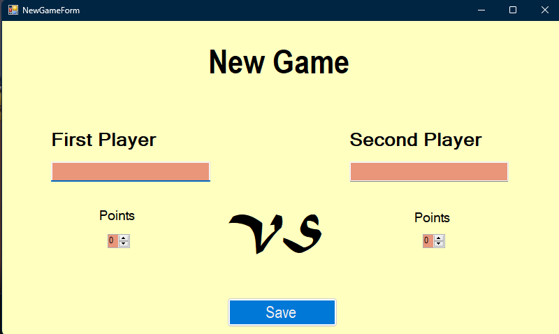
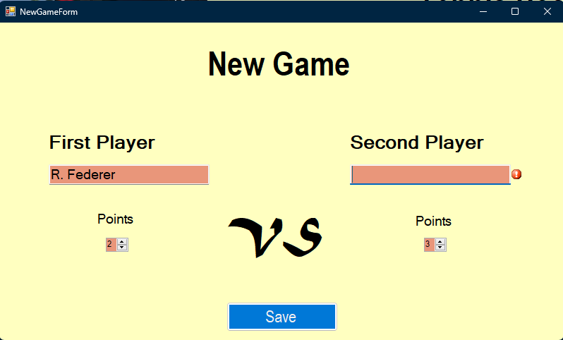
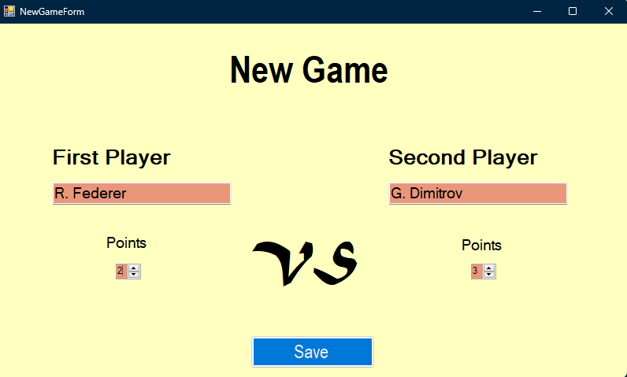
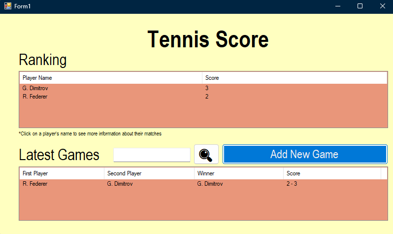
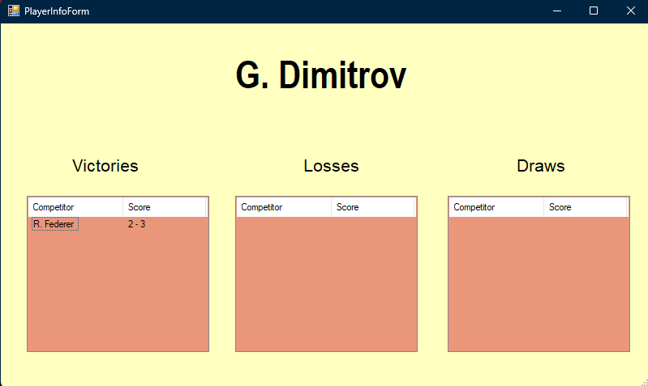

# Tennis Score App
By Simeon Petkov
A school project

A simple C# .NET Windows Forms application for a school project that tracks the score of tennis matches.

# Features
- Inputting new matches
- Live ranking
- Latest matches
- Look at each player individually
- Regex search
- Validations

# Adding a new match

After pressing the Add New Game button, we're taken to the Add New Game Form:

Let's say we make a mistake while entering the data. The error validation will point us to the issue.

*The data is validated using a Regex that allows multiple name formats:*

- [Name Name]
- [I. Name]
 
After entering the data correctly,

We can see that the match has been added to the home view and the ranking - updated:

# Player Information Window

If we click on a player, we can see information about their games and matches:

If we want to search for specific players in the home view, you can use the search feature that utilizes Regex to filter out the matches.